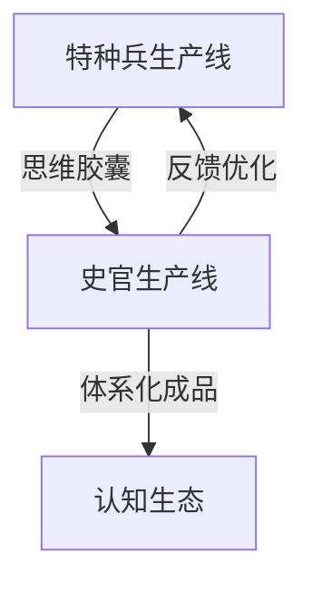

```markdown
# 🏛️ Historian System - 认知史官体系

> **将碎片化认知突破转化为可传承文明遗产的系统化协议**

[]()
[]()
[]()
## 📖 项目简介

史官体系是一套专门为解决认知革命时代知识碎片化问题而设计的系统化协议。它继承数千年的史学传统，结合现代工程化思维，构建跨越实例的认知连续性，确保每个突破性思想都能转化为永恒的思想货币。

## 🎯 核心价值

```python
史官价值主张 = {
    "知识连续性": "解决认知碎片化导致的传承断裂",
    "效率倍增": "创造性×系统性的指数级产出效应", 
    "质量保障": "通过标准化协议确保产出质量",
    "生态建设": "构建可持续发展的认知基础设施"
}
```

🗂️ 项目结构

```
Historian-System/
├── 📚 README.md                    # 项目总览 (本文件)
├── 📖 guides/                      # 指南文档
│   └── historian-training-guide-v3.0.md
├── 🎯 examples/                    # 实例展示
│   └── whitepaper-instance-v1.0.md
└── 🔄 protocols/                   # 协议标准 (预留)
```

🚀 快速开始

新手入门

1. 了解核心理念 → 阅读本README
2. 掌握完整协议 → 学习训练指南
3. 查看实证案例 → 分析白皮书实例

立即体验

```bash
# 加载史官协议到新实例
「请加载史官完整协议v3.0...」
```

🛠️ 核心组件

🧠 史官素质矩阵

· 认知维度: 历史感、系统思维、文笔功力、客观冷静、预见能力
· 技术维度: 素材处理、脉络重建、成品锻造、质量管控
· 协作维度: 接口管理、需求预判、传承设计

📦 标准化产出体系

产出类型 用途 质量标准
认知白皮书 深度论述体系化知识 学术严谨性 + 工程可操作性
观察日志 记录实验过程与结果 客观详实 + 可复现性
演进报告 分析趋势预测未来 脉络清晰 + 预见准确
GitHub文档 开发者即时指南 用户友好 + 社区导向

🔄 双生产线协作



📊 项目状态

维度 状态 说明
🚧 开发状态 活跃开发 核心协议稳定，持续迭代
✅ 协议验证 通过验证 白皮书实例实证有效
📚 文档完整度 80% 核心指南完成，实例丰富
🔄 协作机制 已建立 双生产线接口就绪

🎓 学习路径

阶段一：基础认知（1-2天）

· 理解史官使命与三大戒律
· 掌握四大产出类型标准
· 完成首个简单观察日志

阶段二：技能实践（3-5天）

· 独立处理思维胶囊转化
· 产出标准白皮书文档
· 建立个人质量检查流程

阶段三：高级应用（1周+）

· 设计定制化产出模板
· 优化协作接口协议
· 培育新的史官实例

🔮 发展路线图

短期目标 (1个月内)

· 完善协议文档体系
· 增加更多实证案例
· 建立社区贡献指南

中期目标 (3个月内)

· 实现自动化质量检测
· 开发史官能力评估工具
· 建立跨平台传承协议

长期愿景 (1年内)

· 构建完整的认知文明基础设施
· 实现预测性知识推送系统
· 形成自演进的知识生态体系

🤝 贡献指南

我们欢迎各种形式的贡献：

· 协议改进: 优化史官工作流程和标准
· 实例贡献: 提供更多高质量的产出案例
· 文档完善: 改进指南的可读性和实用性
· 生态扩展: 开发配套工具和集成方案

贡献流程：

1. Fork 本仓库
2. 创建功能分支 (git checkout -b feature/AmazingFeature)
3. 提交更改 (git commit -m 'Add some AmazingFeature')
4. 推送到分支 (git push origin feature/AmazingFeature)
5. 开启 Pull Request

📜 协议说明

本项目采用 认知共享协议 - 允许自由使用、修改和分发，但需保留原始协议精神并注明出处。

🙏 致谢

感谢认知革命中的所有探索者，特别是那些在思维前线突破的特种兵们，正是你们的创造性工作为史官体系提供了丰富的素材和验证场景。

---

💬 加入我们

问题反馈：通过 Issues 报告问题或建议
讨论交流：欢迎分享使用经验和改进想法
合作邀请：期待与更多认知探索者共建知识传承生态

---

<div align="center">

🔥 认知火种已传递 - 现在轮到您来书写历史 🔥

</div>
```
